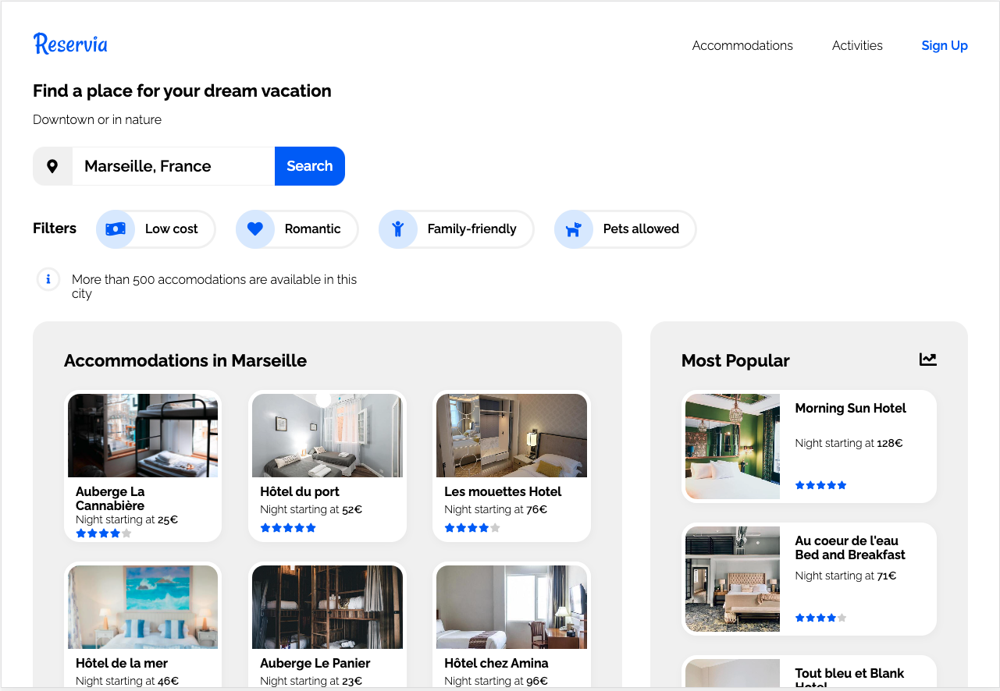

# Reservia | Travel Website

## Description

Reservia is a website offering a vacation planning tool. Their site allows users to find accommodations and activities in the city of their choice. Accommodations can also be filtered.

Aim of the project was to **turn mockups into a webpage**. Mockups for the Reservia Travel Website were provided for desktop and mobile, as well as a logo and all images. In addition to building the site, I had to make my own adaptions for a tablet layout and determine suitable breakpoints.

## Objectives

- text of **search input field can be edited** by the user (search button not functional)
- all accommodation or activity **cards are clickable** in their entirety (links are empty)
- on hover, **filter buttons change their appearance** (filters not functional)
- accommodations and activities **nav elements are anchor links** leading to respective section of page
  The website content can be divided into **three parts**.

## Requirements

- no framework or pre-compiler to be used
- use of FontAwesome
- use of Google Fonts
- use of Flexbox
- must pass W3C validation for HTML and CSS without errors
- must be fully responsive
- must be fully compatible with latest versions of Chrome and Firefox (Feb 2021)

## Challenges & Accomplishments

- Use webkit and moz for search input field placeholder styling

## Acquired Skills

- Track a code project with verison control on GitHub
- Set up a development environment
- Implement a responsive layout
- Intergrate web content according to a mockup using HTML & CSS

## Demo

[Link to website](https://christinebogdan.github.io/p1_TravelWebsite/)

# 
